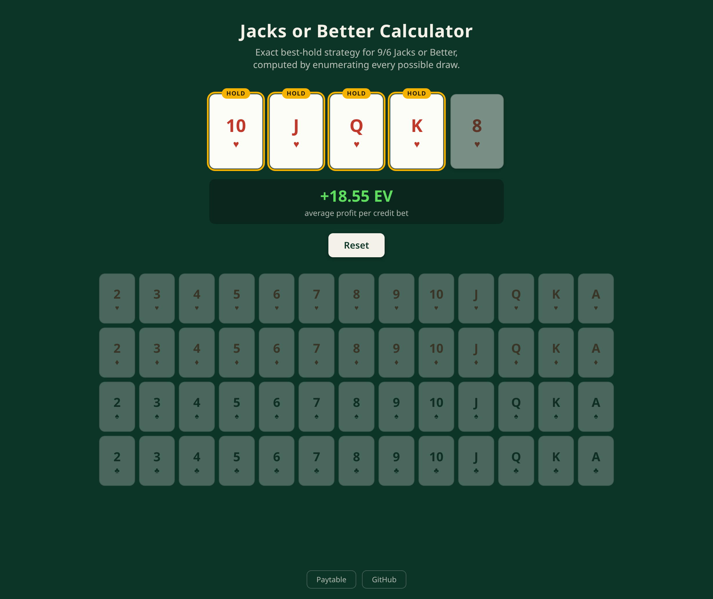

# Jacks or Better Calculator

Computes the optimal hold for any hand of 9/6 Jacks or Better.

Live site: [felixmclean.github.io/jacks-or-better](https://felixmclean.github.io/jacks-or-better/)

## How it works

The user selects a five card hand and the app evaluates all 32 ways to hold a subset of them.
The best hold for each hand is highlighted and the EV is shown as net profit per credit bet.

## Design decisions

- The state space is small enough to solve outright in the browser (a full solve evaluates ~2.6 million hands in 0.25 seconds), so every EV comes from checking every possible draw instead of estimating with simulation.
- Payouts are summed as integers and divided once at the end, so each EV is an exact ratio with no accumulated floating point error.
- EV ties break toward holding more cards, so a four of a kind keeps its kicker instead of pointlessly discarding it.
- The paytable on the site is rendered from the same object the evaluator scores with, so the display can never drift from the engine. The 99.54% optimal-play return shown is standard for 9/6 Jacks or Better, not something the program computes.
- The test suite runs in the browser at [felixmclean.github.io/jacks-or-better/tests](https://felixmclean.github.io/jacks-or-better/tests/). It covers reference hands for every rank and a few hand-derived EV checks (925/47 for four cards to a royal flush).

## Stack

- Plain JavaScript, HTML, and CSS as ES modules
- No framework, no dependencies, no build step
- GitHub Pages
